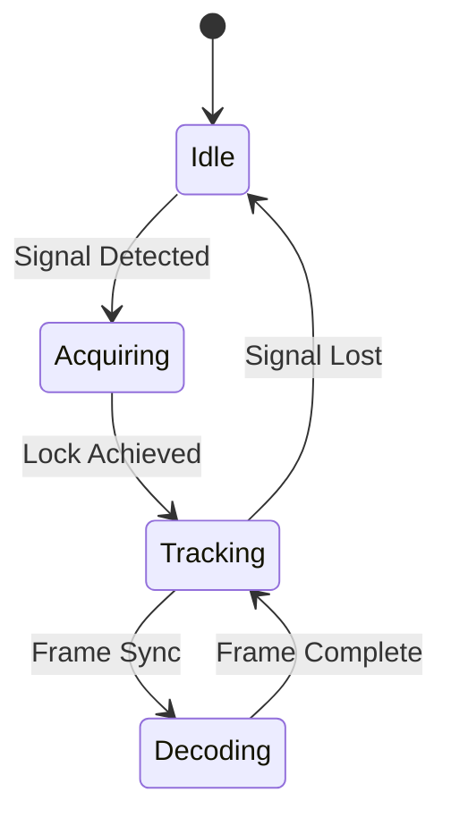
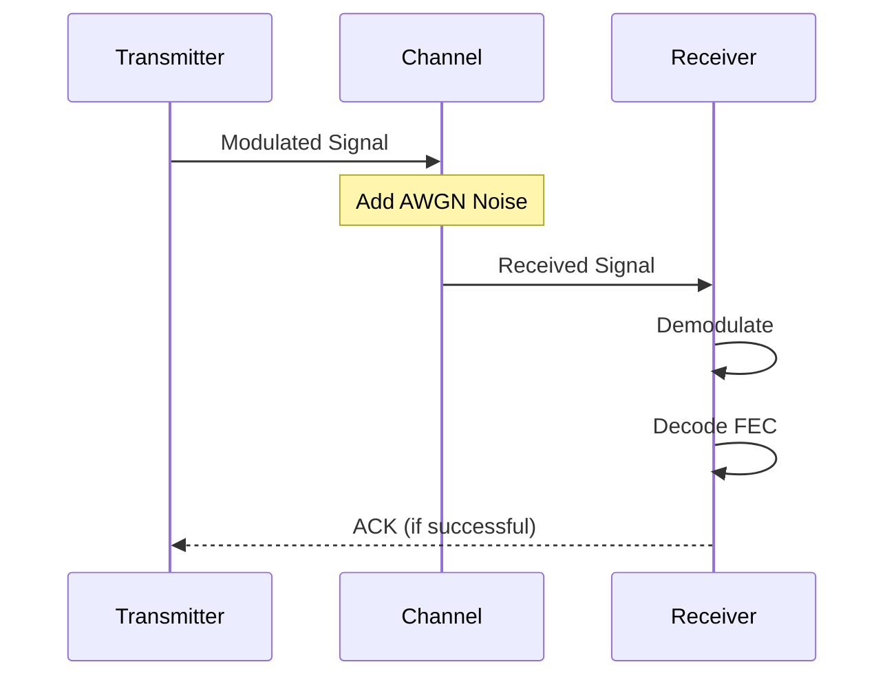
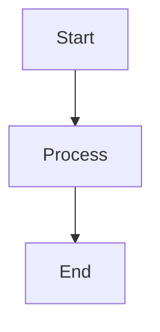

# Diagram Guidelines for Chimera Documentation

**Best practices for creating and maintaining diagrams in the wiki**

---

## Current State: ASCII Diagrams

The wiki currently uses ASCII art diagrams for visualization. While these render universally in Markdown, they have limitations:

### Advantages of ASCII Diagrams ✅
- ✅ Render in any Markdown viewer (GitHub, text editors, PDFs)
- ✅ Version control friendly (text-based, clean diffs)
- ✅ No external dependencies or build tools
- ✅ Fast to create for simple diagrams
- ✅ Accessible (screen readers can parse text)

### Limitations of ASCII Diagrams ❌
- ❌ Limited visual complexity
- ❌ Difficult to create precise technical diagrams
- ❌ Hard to maintain consistency
- ❌ Cannot show color or gradients
- ❌ Poor scalability for complex systems
- ❌ Time-consuming to update

---

## Recommended Approach: Hybrid Strategy

**Use the right tool for the job**:

1. **Simple concepts** → ASCII art (keep it!)
2. **Complex systems** → Mermaid diagrams
3. **Mathematical plots** → Python/Matplotlib with saved images
4. **Constellation diagrams** → Live Chimera simulator

---

## Option 1: Keep ASCII Art (Current)

**When to use**: Simple 2D diagrams, small constellations, basic flow

### Current ASCII Patterns in Wiki

#### Constellation Diagrams
```
     Q (Imaginary)
          ↑
          |
     ┌────┼────┐
     │ •  |  • │  Each dot represents
     │    |    │  a valid symbol position
  ───┼────+────┼───→ I (Real)
     │    |    │
     │ •  |  • │
     └────┼────┘
          |
```

**Status**: ✅ **Keep as-is** - Simple and effective for teaching

#### Signal Paths
```
TX: Bits → Encoder → Modulator → Channel → Demodulator → Decoder → Bits
         ↓                                              ↑
      Add FEC                                      Correct errors
```

**Status**: ✅ **Keep as-is** - Clear linear flow

#### Waveforms
```
Binary Signal:
  ┌─┐     ┌─┐
  │ │     │ │
──┘ └─────┘ └──
  1   0   1   0
```

**Status**: ⚠️ **Consider Mermaid for complex timing diagrams**

---

## Option 2: Mermaid Diagrams (Recommended for Complex Diagrams)

**When to use**: Block diagrams, flowcharts, sequence diagrams, state machines

### Why Mermaid?
- ✅ Renders natively on GitHub
- ✅ Text-based (version control friendly)
- ✅ Professional appearance
- ✅ Easy to update
- ✅ Supports many diagram types

### Example: System Architecture

**Instead of:**
```
┌──────────┐     ┌──────────┐     ┌──────────┐
│ Encoder  │────▶│Modulator │────▶│ Channel  │
└──────────┘     └──────────┘     └──────────┘
     ▲                                   │
     │                                   ▼
┌──────────┐     ┌──────────┐     ┌──────────┐
│  Bits    │     │ Decoder  │◀────│Demodulat │
└──────────┘     └──────────┘     └──────────┘
```

**Use Mermaid:**


### Example: State Machine



### Example: Sequence Diagram



### How to Add Mermaid to Wiki

Just use triple backticks with `mermaid`:

````markdown

````

GitHub renders it automatically!

---

## Option 3: Generated Images (For Complex Plots)

**When to use**: BER curves, frequency responses, spectral plots, complex constellations

### Python + Matplotlib Example

For wiki pages needing complex plots, include a Python script in `/scripts/` and commit the generated PNG:

```python
# scripts/generate_ber_curves.py
import matplotlib.pyplot as plt
import numpy as np

def ber_qpsk(snr_db):
    snr = 10**(snr_db/10)
    return 0.5 * erfc(np.sqrt(snr))

snr_range = np.linspace(0, 15, 100)
ber = ber_qpsk(snr_range)

plt.figure(figsize=(8, 6))
plt.semilogy(snr_range, ber)
plt.grid(True, which='both', alpha=0.3)
plt.xlabel('SNR (dB)')
plt.ylabel('Bit Error Rate')
plt.title('QPSK BER Performance in AWGN')
plt.savefig('../wiki/images/ber_qpsk.png', dpi=150, bbox_inches='tight')
```

Then in wiki:
```markdown

```

### Pros and Cons

**Pros**:
- ✅ Professional quality
- ✅ Precise mathematical plots
- ✅ Reproducible (script in repo)

**Cons**:
- ❌ Binary files in git (images)
- ❌ Requires regeneration for updates
- ❌ Harder to diff changes

---

## Option 4: Live Simulator (For Interactive Diagrams)

**When to use**: Constellation diagrams, real-time signal processing visualization

The Chimera web app provides **live, interactive** visualizations that static diagrams cannot match.

### In Wiki Pages:

```markdown
## Observing Constellations in Chimera

**Live Demo**: [Try Chimera Simulator](https://impermanent.io)

1. **TX Constellation Panel**: See the ideal QPSK symbol positions
2. **RX Constellation Panel**: See how noise scatters the received symbols
3. **Adjust SNR**: Watch how constellation quality changes in real-time

The constellation is the most intuitive way to understand signal quality!
```

---

## Migration Strategy

### Phase 1: Keep Existing ASCII ✅
- No immediate changes needed
- ASCII diagrams work well for current wiki
- Focus on content quality over visual perfection

### Phase 2: Add Mermaid for New Complex Diagrams (Recommended)
- Use Mermaid for new architectural diagrams
- Convert complex ASCII flowcharts to Mermaid (if time permits)
- Keep simple ASCII diagrams unchanged

### Phase 3: Generate Plots for Technical Pages (Optional)
- Create script to generate BER curves
- Add frequency response plots
- Generate constellation comparisons

### Phase 4: Link to Live Simulator (Ongoing)
- Emphasize live visualization in wiki
- Add "Try in Chimera" links
- Reduce static constellation diagrams

---

## Wiki-Specific Recommendations

### Pages That Are Fine with ASCII:
- ✅ **Constellation-Diagrams.md** - Simple QPSK examples
- ✅ **What-Are-Symbols.md** - Basic concept diagrams
- ✅ **IQ-Representation.md** - 2D axes
- ✅ All modulation pages with simple symbol tables

### Pages That Could Benefit from Mermaid:
- ⚠️ **Signal-Chain-(End-to-End-Processing).md** - Complex pipeline
- ⚠️ **Channel-Equalization.md** - Filter block diagrams
- ⚠️ **Synchronization-(Carrier,-Timing,-Frame).md** - State machines
- ⚠️ **OFDM-&-Multicarrier-Modulation.md** - Subcarrier allocation
- ⚠️ **architecture-node-graph.md** - System architecture

### Pages That Could Benefit from Generated Plots:
- ⚠️ **Bit-Error-Rate-(BER).md** - BER curves
- ⚠️ **Channel-Models-(Rayleigh-&-Rician).md** - Fading distributions
- ⚠️ **Shannon's-Channel-Capacity-Theorem.md** - Capacity vs SNR
- ⚠️ **Spectral-Efficiency-&-Bit-Rate.md** - Efficiency comparison

---

## Style Guide for Diagrams

### ASCII Diagrams

**DO**:
- Use Unicode box-drawing characters: `─│┌┐└┘├┤┬┴┼`
- Use arrows: `→ ← ↑ ↓`
- Keep width under 80 characters for readability
- Add explanatory text alongside diagrams
- Use consistent spacing

**DON'T**:
- Don't mix ASCII and Unicode randomly
- Don't create overly complex ASCII diagrams (use Mermaid instead)
- Don't forget to test rendering in different viewers

### Mermaid Diagrams

**DO**:
- Use descriptive node names
- Add styling for emphasis: `style A fill:#e1f5ff`
- Include legends for color coding
- Keep complexity moderate (split into multiple diagrams if needed)

**DON'T**:
- Don't create overly dense diagrams
- Don't use too many colors (stick to 2-3)
- Don't forget to test on GitHub rendering

### Generated Images

**DO**:
- Save as PNG at 150 DPI minimum
- Use consistent style (same colormap, fonts, sizing)
- Include script in `/scripts/` directory
- Commit both script and generated image
- Add alt text for accessibility

**DON'T**:
- Don't commit massive image files (compress if >500KB)
- Don't use lossy formats for technical diagrams (no JPEG)
- Don't create images without source scripts

---

## Accessibility Considerations

### For Screen Readers

**ASCII Diagrams**: 
- Add descriptive text before diagram
- Explain what the diagram shows in prose
- Don't rely solely on visual representation

**Mermaid Diagrams**:
- GitHub renders these as images with alt text
- Add a prose description before the diagram

**Generated Images**:
- Always include meaningful alt text
- Describe the key insight, not just the visual elements

### Example:

```markdown
## QPSK Constellation

**Description**: QPSK uses 4 symbol positions arranged in a square pattern 
on the IQ plane. Each symbol represents 2 bits, with positions at 
±45° and ±135° from the I axis.

```
     Q
     ↑
  •  |  •   ← 4 positions = 2 bits per symbol
─────┼─────→ I
  •  |  •
```

The diagram above shows the four symbol positions...
```

---

## Decision Matrix

| Diagram Type | ASCII | Mermaid | Generated | Live |
|--------------|-------|---------|-----------|------|
| Simple 2D concept | ✅ Best | ❌ Overkill | ❌ Overkill | ❌ N/A |
| System architecture | ⚠️ Complex | ✅ Best | ❌ Overkill | ❌ N/A |
| Flowchart | ⚠️ OK | ✅ Best | ❌ Overkill | ❌ N/A |
| State machine | ⚠️ Hard | ✅ Best | ❌ Overkill | ❌ N/A |
| BER curve | ❌ Impossible | ❌ Can't | ✅ Best | ⚠️ Good |
| Constellation | ✅ Good | ❌ Can't | ✅ Good | ✅ Best |
| Sequence diagram | ❌ Hard | ✅ Best | ❌ Overkill | ❌ N/A |
| Timing diagram | ⚠️ Hard | ✅ Good | ✅ Best | ❌ N/A |

---

## Action Items for Future Improvements

### High Priority (Nice to Have)
- [ ] Add Mermaid diagram to Signal-Chain-(End-to-End-Processing).md
- [ ] Add Mermaid diagram to architecture-node-graph.md
- [ ] Generate BER curves for Bit-Error-Rate-(BER).md

### Medium Priority (Optional)
- [ ] Convert complex ASCII flowcharts to Mermaid
- [ ] Add timing diagrams for synchronization pages
- [ ] Create script for constellation diagram generation

### Low Priority (Future Enhancement)
- [ ] Standardize diagram styling across all pages
- [ ] Create diagram template library
- [ ] Add interactive plots with plotly/d3.js

---

## Conclusion

**Current recommendation**: **Keep ASCII diagrams for now** ✅

The existing ASCII diagrams in the wiki are effective for teaching fundamental concepts. They render universally and are easy to maintain.

**Future enhancement**: Gradually introduce **Mermaid diagrams** for complex system architecture and flowcharts where ASCII becomes limiting.

**Don't over-engineer**: Simple text-based diagrams are often more accessible and maintainable than complex generated images. Prioritize clarity over visual polish.

---

**Document Owner**: Chimera Project Documentation Team  
**Last Updated**: October 4, 2025  
**Status**: Guideline Document (Non-Normative)

For questions or suggestions, open an issue on [GitHub](https://github.com/ArrEssJay/chimera/issues).
