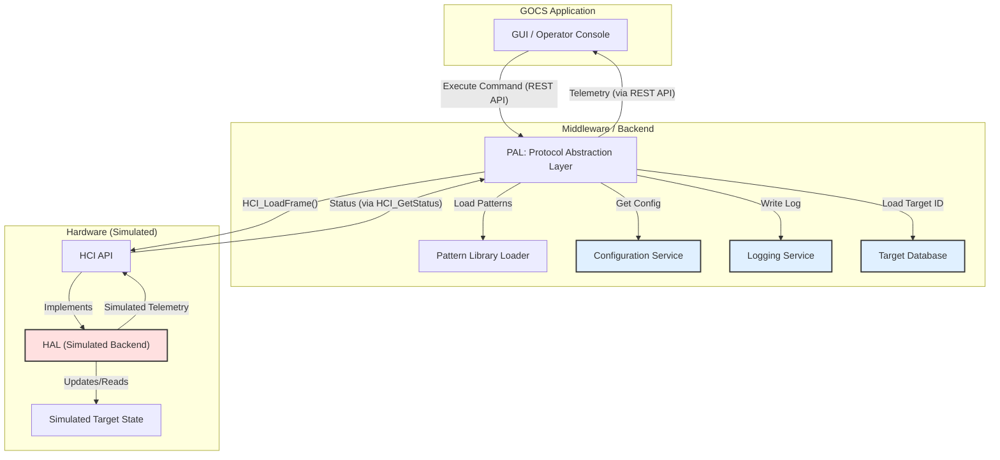

# **Specification: Demonstration Implementation Scaffolding**
**FILE:** `chimera/implementation/demo_scaffolding_v1.0.spec`  
**DOCUMENT TITLE:** Project Chimera: Software Scaffolding for Demonstration Implementation

---

## 1.0 Overview

This document specifies the essential software components required to create a self-contained, runnable demonstration of the Chimera software stack. The primary goal is to enable development, testing, and validation of the GOCS and PAL without requiring physical THz hardware.

This is achieved through the creation of a **Hardware Abstraction Layer (HAL)** with a simulated backend, along with the necessary services for configuration, logging, and inter-process communication.

## 2.0 Required Software Components

### 2.1 Hardware Abstraction Layer (HAL) & Simulator

This is the most critical component. The HCI is an *interface* specification; the HAL is its *implementation*. For a demo, it will have two modes:

*   **Null HAL:** A simple pass-through that accepts HCI commands, logs them, and returns `STATUS_OK`. This is used for unit testing the PAL's logic without the overhead of simulation.
*   **Simulated HAL:** A stateful backend that simulates the target and the hardware.

**Features of the Simulated HAL:**
*   **Simulated Target State Machine:**
    *   Maintains a "Target" object with state variables (e.g., `cognitive_state`, `coherence_level`, `brainwave_freq`).
    *   The state machine will react to incoming waveforms. For example, receiving a frame generated from `COH.ThetaCalm` will gradually decrease the `brainwave_freq` variable towards 6 Hz and change the `cognitive_state` to `CALM`.
    *   Receiving `DIS.CognitiveScramble` will set `cognitive_state` to `CONFUSED` and randomize the `brainwave_freq`.
*   **Simulated Bio-Feedback:**
    *   The HAL will expose the `HCI_GetStatus()` function, which will return telemetry based on the Simulated Target's current state. This allows the GOCS GUI to display a "live" feedback loop.
*   **Waveform Effect Model:**
    *   A simplified mathematical model that interprets the incoming frame's `Data Payload`. It does not need to simulate the full quantum physics, but it should be able to differentiate between LFO shapes (e.g., a `SINE` shape has a calming effect, a `NOISE` shape has a disruptive effect).
*   **Simulated Hardware Faults:**
    *   The HAL should be capable of being configured to inject errors (e.g., return `ERROR_FREQ_LOCK_FAILED`) to test the PAL's and GOCS's error-handling capabilities.

### 2.2 Configuration Management Subsystem

To avoid hardcoding parameters, a simple configuration service is needed.
*   **Format:** A human-readable format like YAML or INI.
*   **Responsibilities:**
    *   Manages IP addresses and ports for communication between GOCS and PAL.
    *   Defines the location of the `base_pattern_library.dat` file.
    *   Sets the initial state of the HAL simulator (e.g., default target state).
    *   Defines logging levels (e.g., DEBUG, INFO, ERROR).

### 2.3 Logging and Telemetry Service

A centralized service to capture the flow of data and commands through the system for debugging and analysis.
*   **Function:**
    *   Logs every high-level command issued from the GOCS.
    *   Logs the key parameters of the frame generated by the PAL.
    *   Logs every command sent to the HCI/HAL.
    *   Logs all status updates and errors returned from the HAL.
*   **Output:** Logs to both a console for real-time viewing and a file for later analysis.

### 2.4 Inter-Process Communication (IPC) Framework

The GOCS (GUI) and the PAL (backend compiler) will likely run as separate processes. A defined communication protocol is required.
*   **Choice of Framework:** For a demonstration, a simple framework is best.
    *   **REST API:** The PAL exposes a simple web server (e.g., using Flask/FastAPI in Python) with endpoints like `/api/execute_command` and `/api/get_status`. The GOCS is the client.
    *   **gRPC:** A more performant option if high-speed communication is a design goal.
*   **API Definition:** This would be a small but crucial spec, defining the exact JSON/protobuf messages for sending commands and receiving status updates.

### 2.5 Data Persistence and Management

The Target ID signatures and the Base Pattern Library need to be loaded from somewhere.
*   **Target Database:** For a demo, this can be a simple JSON or CSV file that maps target names to their 32-bit `Target ID` hex codes.
*   **Pattern Library Loader:** A module within the PAL responsible for parsing the `base_pattern_library.dat` file into memory at startup.

## 3.0 Demonstration Architecture Diagram

This diagram illustrates how all the specified and new components fit together for a runnable demo.

With these scaffolding components defined and implemented, a developer could compile and run the entire software stack on a standard computer, operate the GOCS interface, and watch the simulated target's state change in the telemetry feedback panel, providing a complete, end-to-end demonstration of the system's logic.