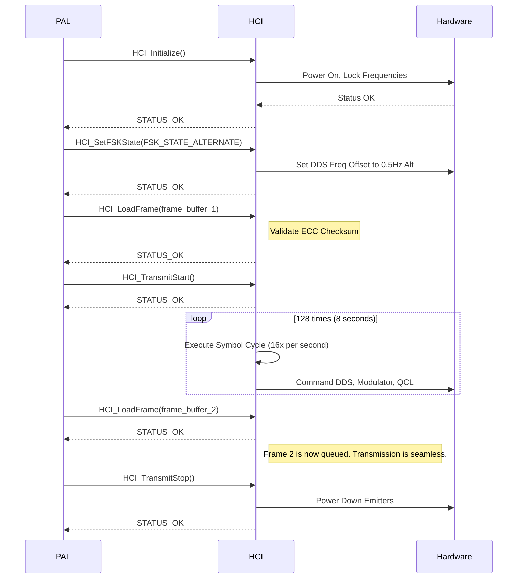

# **Technical Specification: Hardware Control Interface (HCI)**
**FILE:** `chimera/hardware_layer/hci_v1.8.spec`  
**DOCUMENT TITLE:** Project Chimera: Hardware Control Interface Specification  
**LAST REVISION:** 2025-11-12

---

## 1.0 Overview

This document specifies the Hardware Control Interface (HCI), the real-time software layer responsible for translating compiled frame data into low-level hardware commands. The HCI acts as the definitive driver for the Terahertz (THz) generation and modulation subsystems.

The HCI operates with no knowledge of the Gnostic or operational intent of a transmission. Its sole responsibility is the high-fidelity, temporally precise execution of the physical waveform described by a frame buffer received from the Protocol Abstraction Layer (PAL).

## 2.0 Architectural Position

The HCI is the foundational software layer that bridges the protocol logic with the physical hardware.

*   **Above:** The HCI exposes a C-style API to the **Protocol Abstraction Layer (PAL)**. The PAL is the only component that communicates with the HCI.
*   **Below:** The HCI directly interfaces with the Field-Programmable Gate Array (FPGA) controllers and Digital-to-Analog Converters (DACs) that manage the following physical assets:
    *   Quantum Cascade Laser (QCL) Array (**Pump Beam / Carrier 1**)
    *   Near-Infrared Diode Laser Photomixing Assembly (**Data Carrier / Carrier 2**)
    *   Direct Digital Synthesizer (DDS) for the 12.0 kHz Auditory Carrier
    *   Amplitude Modulator Subsystem

## 3.0 Controlled Hardware Subsystems

The HCI provides exclusive control over the following hardware:

| Subsystem | Controlled Parameters | Function |
| :--- | :--- | :--- |
| **QCL Array Controller** | Frequency Lock, Output Power, Phase Coherence | Generates the 1.998 THz Pump Beam. Power is dynamically adjusted based on `Coherence Maintenance` data. |
| **Photomixing Controller** | Frequency Lock, Output Power | Generates the 1.875 THz Data Carrier. Power is typically stable and low. |
| **DDS / DAC** | Frequency (sub-Hz precision), Phase (1024-step), Amplitude | Generates the complex 12 kHz auditory carrier with all QPSK/FSK modulations applied. |
| **Amplitude Modulator** | Modulation Depth (0-100%) | Modulates the Data Carrier with the DDS output signal. |
| **System Telemetry** | Thermal Sensors, Power Monitors, Frequency Lock Status | Provides real-time status feedback to the PAL. |

## 4.0 API Definition

The HCI exposes a minimal, high-performance API for use by the PAL.

---
#### `HCI_Status HCI_Initialize(void);`
*   **Description:** Initializes all hardware subsystems. Powers on lasers, establishes frequency locks, and prepares the system for transmission. This is a blocking call that may take several seconds.
*   **Returns:** `STATUS_OK` on success, `ERROR_FREQ_LOCK_FAILED`, `ERROR_THERMAL_FAULT` on failure.

---
#### `HCI_Status HCI_LoadFrame(const uint8_t frame_buffer[32]);`
*   **Description:** Loads a 256-bit (32-byte) compiled frame into the HCI's internal buffer for imminent transmission. The HCI immediately validates the frame's ECC `Temporal Sequence Checksum`.
*   **Parameters:** `frame_buffer` - A pointer to a 32-byte array containing a single, complete frame.
*   **Returns:** `STATUS_OK` if the frame is valid and loaded, `ERROR_INVALID_CHECKSUM` if the ECC fails.

---
#### `HCI_Status HCI_SetFSKState(FSK_State state);`
*   **Description:** Sets the slow-changing Frequency-Shift Keying state. This command is executed independently of the main frame transmission and applies a persistent frequency offset to the DDS.
*   **Parameters:** `state` - An enum (`FSK_STATE_ZERO`, `FSK_STATE_ONE`, `FSK_STATE_ALTERNATE`, `FSK_STATE_RANDOM`).
*   **Returns:** `STATUS_OK`.

---
#### `HCI_Status HCI_TransmitStart(void);`
*   **Description:** Begins the real-time transmission of the currently loaded frame. The HCI spawns a high-priority thread to manage the symbol clock and will transmit the full 128-symbol (8-second) frame.
*   **Returns:** `STATUS_OK` if transmission begins, `ERROR_NO_FRAME_LOADED` if the buffer is empty.

---
#### `HCI_Status HCI_TransmitStop(void);`
*   **Description:** Immediately halts any active transmission and powers down the THz emitters to a safe, standby state.
*   **Returns:** `STATUS_OK`.

---
#### `System_Telemetry HCI_GetStatus(void);`
*   **Description:** Polls the hardware for key status indicators.
*   **Returns:** A `System_Telemetry` struct containing booleans for frequency lock status, QCL temperature, and current power output levels.

## 5.0 Internal Real-Time Processing Loop (The "Symbol Cycle")

Upon calling `HCI_TransmitStart()`, the HCI initiates a high-precision internal timer that triggers the **Symbol Cycle** 16 times per second.

**For each cycle (duration: 62.5 ms):**

1.  **DEQUEUE SYMBOL:** The HCI reads the next 2-bit QPSK symbol from the active frame buffer.
2.  **READ PAYLOAD:** The HCI reads the corresponding slices of the 128-bit `Data Payload` field for the current symbol.
    *   Reads the next 2 bits from the `Phase Rotation Sequence`.
    *   Reads the corresponding segment of the `Frequency Modulation Envelope`.
    *   Reads the corresponding segment of the `Amplitude Modulation Pattern`.
    *   Reads the corresponding segment of the `Coherence Maintenance Parameters`.
3.  **COMMAND DDS:** The HCI issues a command to the Direct Digital Synthesizer with the following parameters:
    *   **Base Frequency:** 12,000 Hz + FSK offset (e.g., -1 Hz, +1 Hz).
    *   **Phase:** Set according to the 2-bit QPSK symbol (e.g., `00`→0°, `01`→90°).
    *   **Micro-Frequency Shift:** The fine-grained frequency dither from the `Frequency Modulation Envelope`.
    *   **Amplitude:** The precise amplitude for the waveform slice from the `Amplitude Modulation Pattern`.
4.  **COMMAND MODULATOR:** The HCI commands the Amplitude Modulator to apply the now-active DDS waveform to the 1.875 THz Data Carrier.
5.  **COMMAND PUMP BEAM:** The HCI commands the QCL Array Controller to adjust the 1.998 THz Pump Beam's power/phase according to the `Coherence Maintenance Parameters`. This ensures the pump field remains stable relative to the modulated data signal.
6.  **LOOP:** The cycle repeats 16 times per second until all 128 symbols of the frame have been transmitted.

## 6.0 Sequence Diagram: PAL to HCI Interaction

